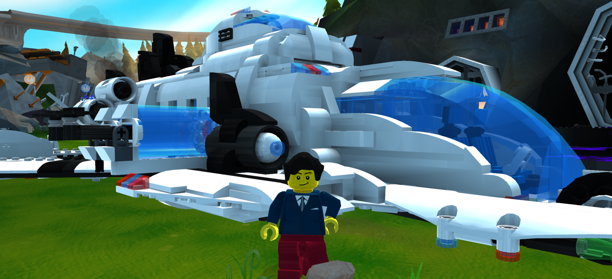
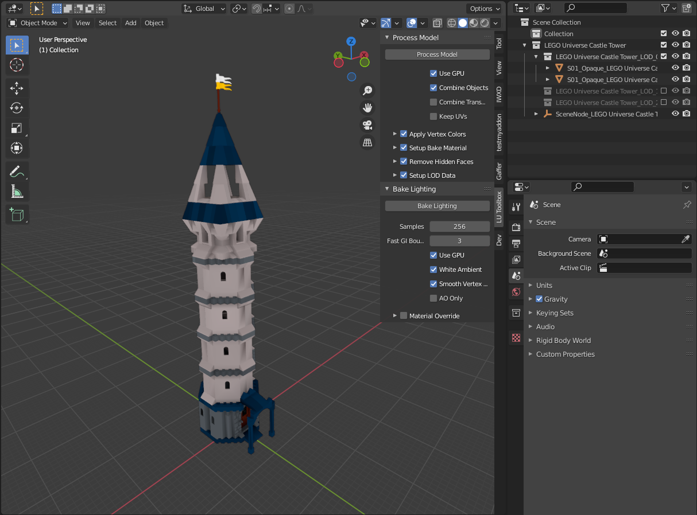
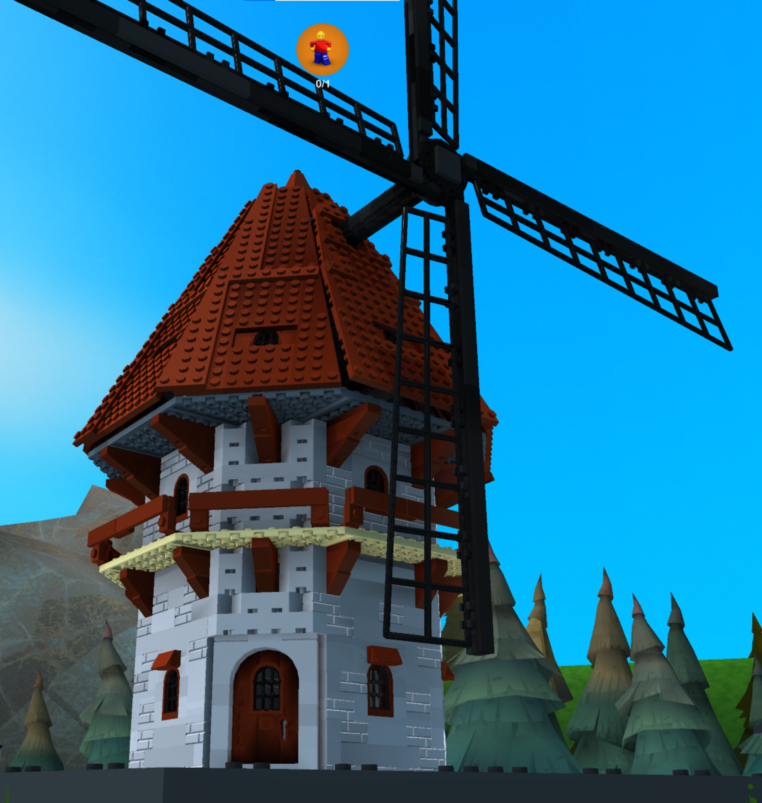
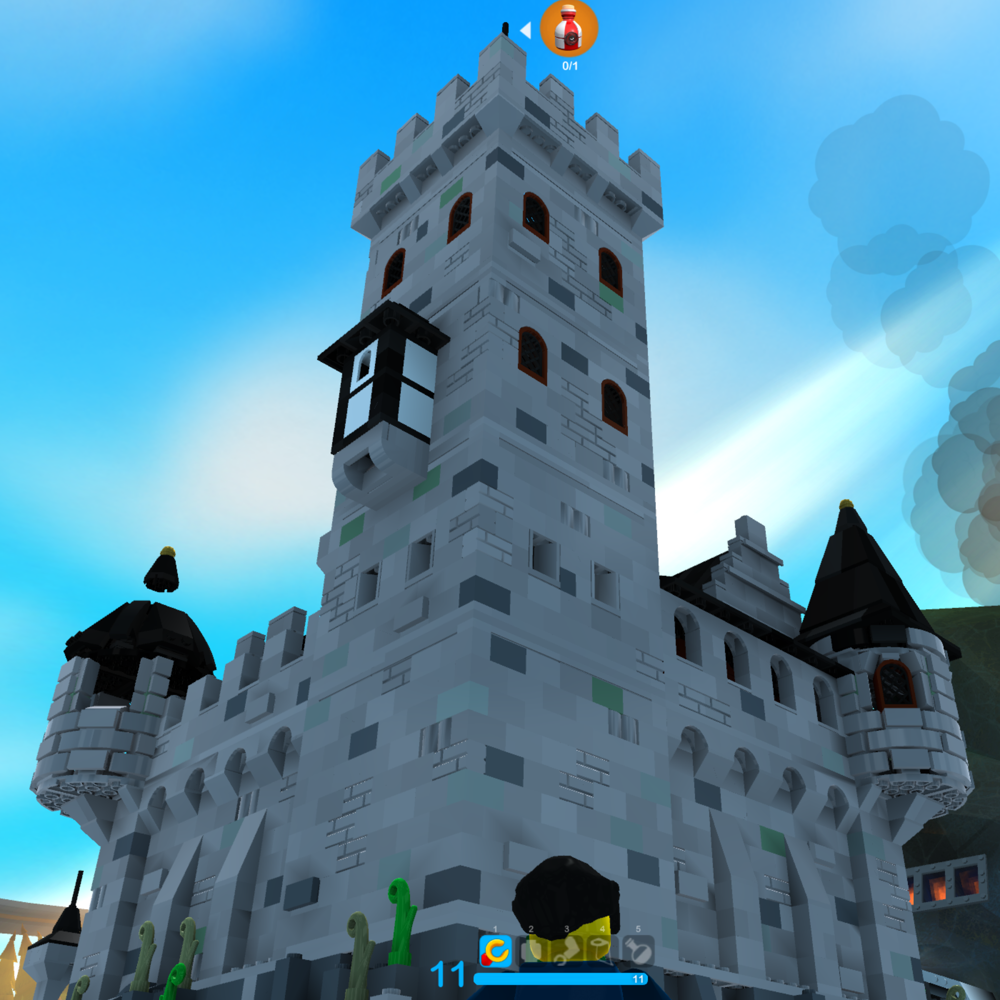
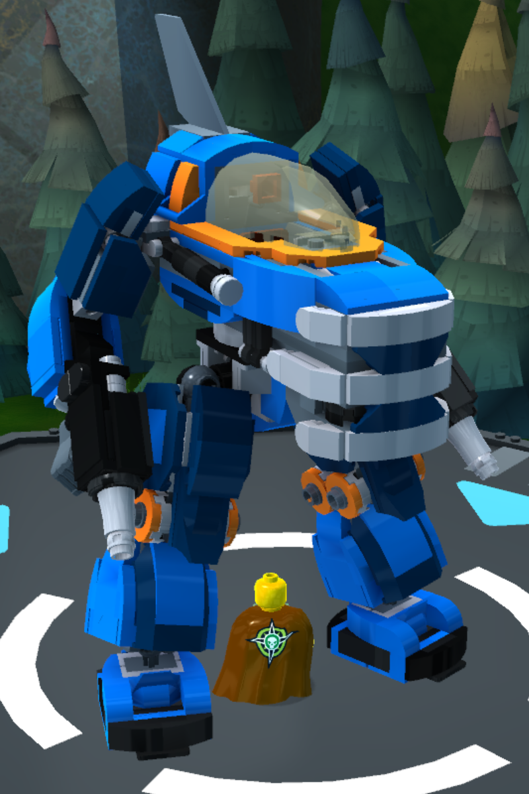

# LEGO Universe Toolbox
A Blender Add-on which adds a bunch of useful tools to prepare models for use in LEGO Universe.

## Features

 * < Put Core toolbox features here >
 * Custom LEGO Exchange Format (.lxf/.lxfml) Importer

## Installation

1. Download the latest release from [here](https://github.com/Squareville/lu-toolbox/releases/latest).
2. Start Blender and navigate to "Edit -> Preferences -> Add-ons"
3. (optional) If you already have an older version of the add-on installed, disable it, remove it and restart blender.
4. Hit "Install" and select the zip archive you downloaded.
5. In the Add-on's preferences, set `Brick DB` to your LU client res folder or extracted Brick DB

After installation you can find the add-on in the right sidepanel (N-panel) of the 3D Viewport.

#### Blender Version

The minimum compatible Blender version is 2.93.
The add-on is generally compatible with Blender 3.0+ but there are a few breaking bugs with vertex color baking that make it almost completely unusable.

## Documentation

- [DLU - Asset Creation Guide](https://docs.google.com/document/d/15YDtHg3-i3Pn6HTEFkpAjKsvUF6u49ZsQam5b614YRw) by [cdmpants](https://github.com/cdmpants)

### LEGO Exchange Format Importer (.lxf/.lxfml)

This importer is derived from [sttng's ImportLDD Add-on](https://github.com/sttng/ImportLDD) with a few changes:

 * Support for importing one or multiple LODs at a time
 * Enchanced Brick DB handling:
   * Support for defining a path to any Brick DB via Add-on Preferences
   * Direct support for using LU's brick db without needing to extract it manually
     * You can use the `client/res/` folder directly as a Brick DB source
     * the `brickdb.zip` will automatically be unzipped for you if it's not already
 * Dropped support for using LDD's `db.lif` directly since it doesn't provide LODs
 * Consolidated color support for LU's color palette:
   * Colors outside of LU's supported pallet will be coerced to the closest color
   * Please report any instances of missing colors so that they can be added
 * Missing data handling:
   * Bricks with missing geo's will be skipped
   * Missing colors will be set to black (Material ID 26)
   * Color missing from secondary geo's are handled correctly
 * Overwrite Scene Option:
   * Delete all objects and collections from Blender scene before importing.

## Screenshots

    
    
    
    

